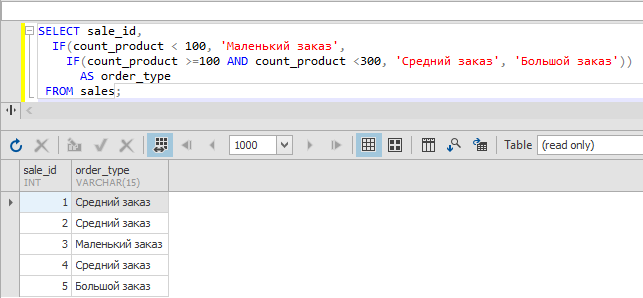

# Базы данных и SQL (семинары)
## SQL – создание объектов, простые запросы выборки

## Задание 1

1. Используя операторы языка SQL, создайте таблицу “sales”. Заполните ее данными. 

<small>Таблица данных к первому заданию</small>

| id | order_date | countproduct |
|----|------------|--------------|
| 1  | 2022-01-01 | 156          |
| 2  | 2022-01-02 | 180          |
| 3  | 2022-01-03 | 21           |
| 4  | 2022-01-04 | 124          |
| 5  | 2022-01-05 | 341          |


```sql
CREATE TABLE sales (
  sale_id int PRIMARY KEY NOT NULL,
  order_date date NOT NULL,
  count_product int DEFAULT 0 NOT NULL
);

INSERT sales (sale_id, order_date, count_product)
  VALUES 
    (1, '2022-01-01', 156), 
    (2, '2022-01-02', 180),
    (3, '2022-01-03', 21),
    (4, '2022-01-04', 124),
    (5, '2022-01-05', 341);
```


## Задание 2

Для данных таблицы “sales” укажите тип заказа в зависимости от кол-ва:
* меньше 100 - Маленький заказ
* от 100 до 300 - Средний заказ
* больше 300 - Большой заказ

<small>Таблица данных ко второму заданию</small>

| id заказа | Тип заказа      |
|-----------|-----------------|
| 1         | Средний заказ   |
| 2         | Средний заказ   |
| 3         | Маленький заказ |
| 4         | Средний заказ   |
| 5         | Большой заказ   |

Выполнить 2мя способами 

### через IF

```sql
SELECT sale_id,
  IF(count_product < 100, 'Маленький заказ', 
    IF(count_product >=100 AND count_product <300, 'Средний заказ', 'Большой заказ')) 
      AS order_type
 FROM sales;
```



### через CASE

```sql
SELECT sale_id,
  CASE 
    WHEN count_product < 100 THEN 'Маленький заказ'
    WHEN count_product > 300 THEN 'Большой заказ'
    ELSE 'Средний заказ'
  END AS order_type  
 FROM sales;
```


## Задание 3
Создайте таблицу “orders”, заполните ее значениями. 

| id | employee_id | amount | order_status |
|----|-------------|--------|--------------|
| 1  | e03         | 15.00  | OPEN         |
| 2  | e01         | 25.50  | OPEN         |
| 3  | e05         | 100.70 | CLOSED       |
| 4  | e02         | 22.18  | OPEN         |
| 5  | e04         | 9.50   | CANCELLED    |

```sql
CREATE TABLE status (
  status_id int NOT NULL PRIMARY KEY,
  employe_id varchar(10) NOT NULL,
  amount numeric(6,2) DEFAULT 0.0 NOT NULL,
  order_status varchar(20) NOT NULL
);

INSERT status (status_id, employe_id, amount, order_status)
  VALUES 
    (1, 'e03', 15.00, 'OPEN'),
    (2, 'e01', 25.50, 'OPEN'),
    (3, 'e05', 100.70, 'CLOSED'),
    (4, 'e02', 22.18, 'OPEN'),
    (5, 'e04', 9.50, 'CANCELLED');
```


Покажите “полный” статус заказа, используя оператор CASE.

Выберите все заказы. В зависимости от поля order_status выведите столбец full_order_status:
* OPEN – «Order is in open state» ;
* CLOSED - «Order is closed»;
* CANCELLED -  «Order is cancelled»

```sql
SELECT status_id, 
  CASE 
    WHEN order_status = 'open' THEN 'Order is in open state'
    WHEN order_status = 'closed' THEN 'Order is closed'
    WHEN order_status = 'cancelled' THEN 'Order is cancelled'
    ELSE 'Unknown'
  END AS full_order_status
FROM status
```


## Задание 4

Чем 0 отличается от NULL?

**0** - это конкретное, математически определяемое значение для числовых полей БД (int, decimal, numeric, money, ...)

**NULL** - значение, обозначающее пустоту, по сути некое абстрактное "ничто" - своеобразный вакум любых возможных значений, может применяться к любым типам полей в БД
